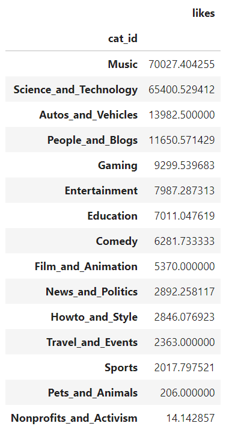

# YT-Views-Prediction_Model
## Project Intro
  - [Final WebApp](https://nick-petruccelli-yt-views-pred-yt-like-prediction-webapp-od29m2.streamlit.app/)
  - For the final product of this project i created a website useing streamlit that will give you an estamate of how manny likes similar Youtube to the one you gave the model have. This will allow Youtube content creaters to compare there videos likes to the averedge of similar videos to get a feel for how there videos have been recived by there comunity.
  - To make the prediction I used a random forest regressor from scikit-learn that scored a mean absolute error of 300 on my test data.
  - The data was collected with the Youtube API where I collected a random sample of 2000 videos.
  - For exploratory analisis I used mainly histograms bar charts and pivot tables to get a beter understanding of the data i was working with and look at realationships between diffrent variables.
  
## Resources Used
  -  Python 3.9
  - Youtube API
  - Jupiter Notebooks and Spyder IDE
  - Libraries: Pandas, MatplotLib, Seaborn, Scikit Learn, Numpy, Streamlit, Pickle, Requests.
  - Corelation Heatmap article: https://medium.com/@szabo.bibor/how-to-create-a-seaborn-correlation-heatmap-in-python-834c0686b88e
## Data Collection
  - Used Youtube API call to get list of 2000 random video ids
  - Used second API call with specific video ids in order to get more data on videos
  - Took data from json returned from API calls and transfered it to pandas dataframe
  - Exported dataframe as csv so it could be cleaned
## Data Cleaning
  - Created function that converted the videos catigory ids from a number to its name
  - Created function to convert video duration from ISO 8601 to minutes
  - Droped rows with Na values for likes comments and veiws
  - Added description length feture
  - Added like to veiw ratio and comment to veiw ratio fetures
## Exploratory Analisis
**For the EDA I broke the anilisis into two parts, those being the exploration of the continuos variables and the catigorical variables.**

**When looking at the continuos variables there are three key take aways I found.**
  - Almost all of our continuos variables have an exponential distribution so we should keep that in mind when picking what models to use to best make predictions based on this data.
  - Likes, Veiws, and comments all seem to be positivly corelated with eachother which intuitivly makes sense, this means that when we make our models we should consider only choosing likes or comments in order to reduce multicoliniarity.

**Within the catigorical variables there was a lot of interesting findings but these were the ones i found most notable.**
  - Politics, Sports, Entertainment, and Gaming are the most popular catigories on Youtube.
  - Almost all of the 2000 videos I collected were in high definition.

**I then created a couple of piviot tabels that i was able to use to draw the following conclutions.**
  - The first thing i noticed was that non-profits had on averedge the most veiws but the the lowes veiwer interation scores. this was very curios untill I looked at the catigories by video duration where you can see that on averedge non-profit videos are only around 30 seconds which means they are probalby just youtube shorts that they use as ads so people get them in there feeds but just skip over them.
  - Politics had the highest coment to veiw ratio which is very interesting an intuitivly makes sense bucause it is a very emotinal topic that people have alot of opinions about.
  - Science and technology way the third most viewed type of video which i found suprising because i figured most people would find that topic boring.
  - Education videos had one of the lower averede veiw counts but one of the higher averedge comment counts. I would bet this is because people leave alot of comments asking for more details on how to do whatever it is the video is trying to teach. Auto and veichle videos had a simmilar phenominon which i would argue was for the same reason.

      

## Building The Model
For the model I wanted to build somthing that would estimate the likes a video should have.
  - I started by picking the variables that I thoght would work best with the types of models i was planning on using as well as variable that would have as little multicolliniarity as posible
    - I ended up chooseing cat_id, vid_duration, definition, comments, veiws, desc_length
  - I then used pandas to turn my catigorical variables into dummy variables 
  - Using Scikit Learn I created train test split where 80% of the data was training data and 20% was test data.
  - I decided to build  a random forest regressor model because I figured that the videos catigory would be a big factor in the abount of likes that a video recives and with a linear regression model catigorical variables just add or subtract a set number from the estimateion which i thought would not be very good.
  - Once I had the basic model constructed i used GridsearchCV in order to optimize the model.
  ### Model Results
  I used mean absolute error as my metric for the model.
  
  **Random Forest**: mean absolute error of around 300
  
  ### Model Flaws
  Since my data was only 2000 videos come video catigories only had a few videos in them and some even had none this means that for the catigories with few videos predictions will probably not be too accurate and for the catigoies with no videos i will not be able to provide a estimate.

## WebApp Creation
  - [Veiw Webapp here](https://nick-petruccelli-yt-views-pred-yt-like-prediction-webapp-od29m2.streamlit.app/)
  - Used streamlit to create webapp that took a Youtube videos id then provided a estimation of how manny likes simmilar videos recived so that content creators could get a feel for how there communites likes there videos
  - Used the Streamlit Community Cloud to make my webapp public.
